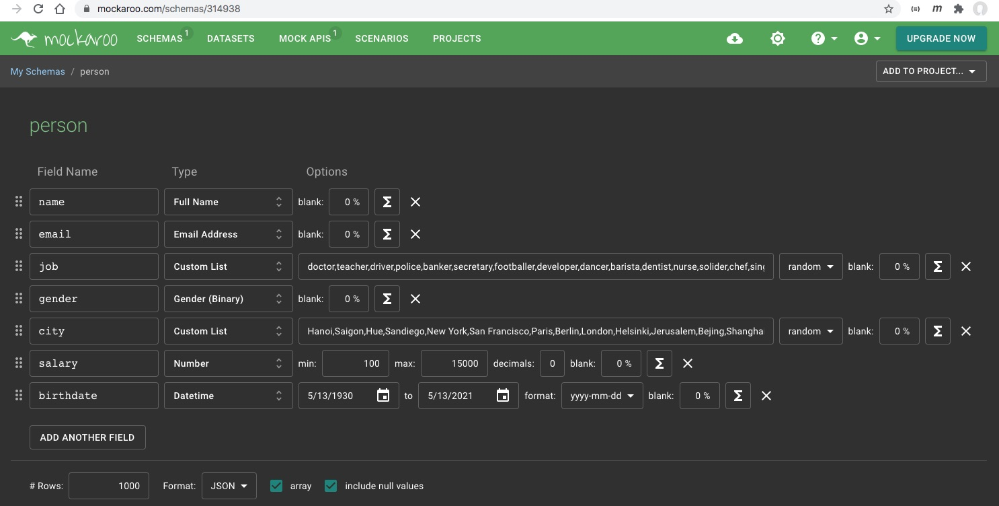

# 1. Đọc dữ liệu từ JSON

trong ví dụ này, tôi đã làm những bước sau đây:
1. Tạo dữ liệu mẫu từ [https://www.mockaroo.com/](https://www.mockaroo.com/), trả về file person.json có 1000 bản ghi
  
2. Xem hướng dẫn ở đây [Parsing JSON files With Golang](https://tutorialedge.net/golang/parsing-json-with-golang/)
3. Sau đó code ra file [app.go](app.go)
4. Chạy thử ứng dụng sẽ in ra
```
Successfully Opened person.json
name: Dee Leng, email: dleng0@cocolog-nifty.com, job: developer, city: London, salary: 9662, birthday: 2007-09-30
name: Sibylla Djurevic, email: sdjurevic1@google.com.br, job: solider, city: Bangkok, salary: 389, birthday: 1956-10-10
name: Rudiger McAughtrie, email: rmcaughtrie2@vimeo.com, job: dentist, city: Saigon, salary: 4736, birthday: 1947-09-16
name: Tim MacElharge, email: tmacelharge3@issuu.com, job: banker, city: Moscow, salary: 12006, birthday: 2006-02-22
name: Leonora Stroyan, email: lstroyan4@yahoo.com, job: developer, city: Bejing, salary: 10494, birthday: 1971-05-22
name: Gaston McAlinden, email: gmcalinden5@google.cn, job: developer, city: Paris, salary: 4025, birthday: 1953-06-17
name: Herbie Balharry, email: hbalharry6@hubpages.com, job: secretary, city: Cairo, salary: 6305, birthday: 2016-07-31
name: Graham Withrop, email: gwithrop7@jalbum.net, job: barista, city: Sandiego, salary: 5914, birthday: 1997-07-10
name: Jess Evers, email: jevers8@zdnet.com, job: cleaner, city: Paris, salary: 14066, birthday: 1956-08-15
name: Marty Priestman, email: mpriestman9@senate.gov, job: driver, city: Jerusalem, salary: 14433, birthday: 1991-01-05
```

## 2. Bài tập thực hành: hãy sử dụng slice, array, map, [set](https://pkg.go.dev/k8s.io/apimachinery/pkg/util/sets) hay bất kỳ cấu trúc dữ liệu nào bạn biết để 

### 2.1 Gom tất cả những người trong cùng một thành phố lại
Viết hàm ```GroupPeopleByCity```
```
- Hanoi 
  - Nguyen Văn X 
  - Nguyên Văn Y
  - Bui Thi Z
- New York
  - John Lenon
  - Iron Man
  - John Biden
- Tokyo
  - Ajino Moto
  - Murakami
  - Kawazaki
```

Code ví dụ
```go
func GroupPeopleByCity(p []Person) (result map[string][]Person) {
	result = make(map[string][]Person)
	for _, person := range p {
		result[person.City] = append(result[person.City], person)
	}
	return result
}
```
### 2.2 Nhóm các nghề nghiệp và đếm số người làm
Viết hàm ```GroupPeopleByJob```
```
developer - 20
secretary - 3
painter - 5
```
### 2.3 Tìm 5 nghề có nhiều người làm nhất, đếm từ cao xuống thấp
Viết hàm ```Top5JobsByNumer```

### 2.4 Tìm 5 thành phố có nhiều người trong danh sách ở nhất, đếm từ cao xuống thấp
Viết hàm ```Top5CitiesByNumber```

### 2.5 Trong mỗi thành phố, hãy tìm ra nghề nào được làm nhiều nhất
Viết hàm ```TopJobByNumerInEachCity```

### 2.6 Ứng với một nghề, hãy tính mức lương trung bình
Viết hàm ```AverageSalaryByJob```
developer - 560
secretary - 450
painter - 800

### 2.7 Năm thành phố có mức lương trung bình cao nhất
Viết hàm ```FiveCitiesHasTopAverageSalary```

### 2.8 Năm thành phố có mức lương trung bình của developer cao nhất
Viết hàm ```FiveCitiesHasTopSalaryForDeveloper```

### 2.9 Tuổi trung bình từng nghề nghiệp
Viết hàm ```AverageAgePerJob```
developer - 30.5
secretary - 42
painter - 41

### 2.10 Tuổi trung bình ở từng thành phố
Viết hàm ```AverageAgePerCity```

